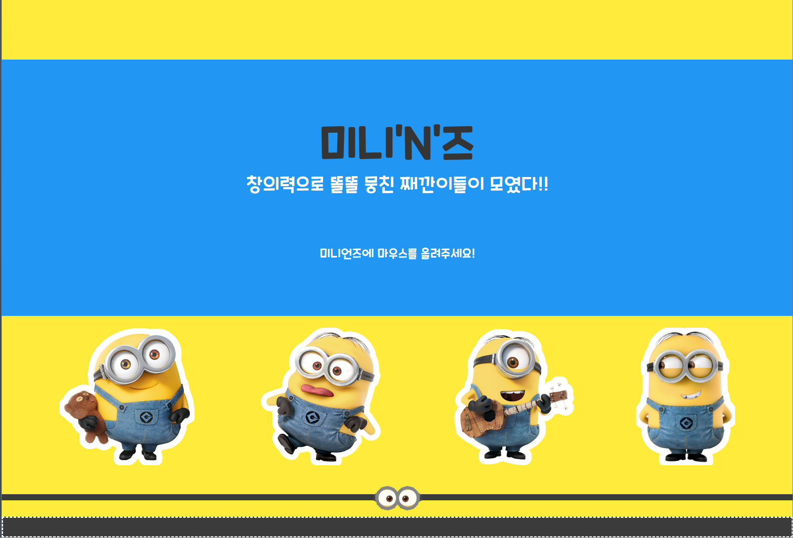

# [미니'N'즈](https://kangsemin.github.io/mini_project_team6/)

## 프로젝트 목표
___

- 웹 개발 전반의 흐름 이해
- 프론트엔드와 백엔드의 구성과 상호작용 이해
- CRUD 구현 및 활용

## 팀원 소개
___

|                 팀장                  |                팀원                |                  팀원                   |                   팀원                    |
|:-----------------------------------:|:--------------------------------:|:-------------------------------------:|:---------------------------------------:|
| [강세민](https://github.com/KangSemin) | [고예나](https://github.com/goo3oo) | [박준호](https://github.com/Park-Junho1) | [홍승근](https://github.com/hongseungkeun) | 
